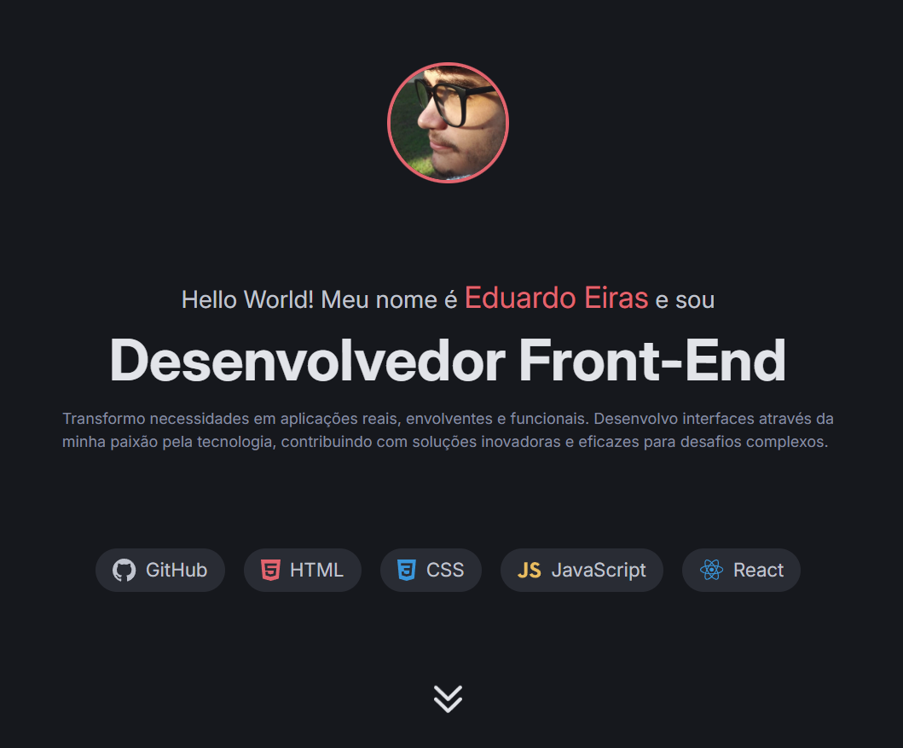

<h1 align="center">Meu Portfolio</h1>

  <a href="#-tecnologias">Tecnologias</a>&nbsp;&nbsp;&nbsp;|&nbsp;&nbsp;&nbsp;
  <a href="#-projeto">Projeto</a>&nbsp;&nbsp;&nbsp;|&nbsp;&nbsp;&nbsp;
  <a href="#-layout">Layout</a>

 

  

## 🚀 Tecnologias

Este projeto foi desenvolvido com as seguintes tecnologias:

- HTML e CSS
- Git e Github
- Figma

## 💻 Projeto

Seja muito bem-vindo(a) ao meu portfolio! Me inspirei em um design que pode ser encontrado no Figma, onde o link para o mesmo está bem [AQUI](https://www.figma.com/design/qa5ZrdJdZ9CDGLcmYikRbv/Portfolio-Dev--Community-?node-id=0-1&p=f&t=KvM6ItSoKC09VOVe-0).

## 🔖 Layout

Você pode visualizar o layout do projeto através [DESSE LINK](https://www.figma.com/design/qa5ZrdJdZ9CDGLcmYikRbv/Portfolio-Dev--Community-?node-id=0-1&p=f&t=KvM6ItSoKC09VOVe-0). É necessário ter conta no [Figma](https://www.figma.com/) para acessá-lo.

---

Made with ♥ by Eduardo Eiras
